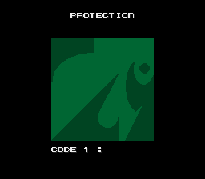
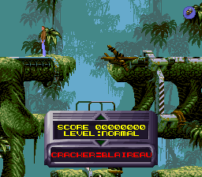
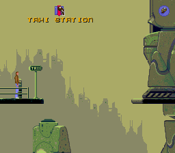
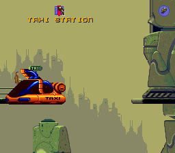

# Flashback Protection Notes

Being released in the early 90s, the developers from Delphine Software protected the game code to prevent piracy.

On start (and later in the game !), the player would have to lookup some symbols in the manual provided with the game.

This document tries to list the game engine routines to be patched to fully unprotect the game.

The addresses and instructions are based on the French DOS version.


## Anti debugging

To make it difficult to attach a debugger to the executable, the game sets up its own vector routine on INT 3.

```
seg000:7CC3 protection_vectorInt3 proc far          ; DATA XREF: protection_installVector+Eo
seg000:7CC3                                         ; sub_0_17CA3+1o
seg000:7CC3       inc _timer_counter
seg000:7CC7       inc _protection_randomVar2
seg000:7CCB       iret
seg000:7CCB protection_vectorInt3 endp

seg000:7C87 protection_installVector proc far       ; CODE XREF: snd_initSoundAndInput+33p
seg000:7C87       mov ax, 3503h
seg000:7C8A       int 21h                           ; DOS - 2+ - GET INTERRUPT VECTOR
seg000:7C8A                                         ; AL = interrupt number
seg000:7C8A                                         ; Return: ES:BX = value of interrupt vector
seg000:7C8C       mov _protection_prev_int3_vector_ptr, bx
seg000:7C90       mov _protection_prev_int3_vector_seg, es
seg000:7C94       push ds
seg000:7C95       mov dx, offset protection_vectorInt3
seg000:7C98       mov ax, cs
seg000:7C9A       mov ds, ax
seg000:7C9C       assume ds:seg000
seg000:7C9C       mov ax, 2503h
seg000:7C9F       int 21h
```

The interrupt is called within the timer routine itself.

```
seg000:7CEC timer_int8Vector proc far               ; DATA XREF: timer_sync+4Eo
seg000:7CEC       push ds
seg000:7CED       push ax
seg000:7CEE       mov ax, seg dseg
seg000:7CF1       mov ds, ax
seg000:7CF3       xor byte_1B73_3661C, 1
seg000:7CF8       jz loc_0_17D2A
seg000:7CFA       int 3                             ; Trap to Debugger

seg000:7A3C       mov al, 0A0h ; 'á'
seg000:7A3E       out 43h, al                       ; Timer 8253-5 (AT: 8254.2).
seg000:7A40       mov ax, 0FFFFh
seg000:7A43       out 42h, al                       ; Timer 8253-5 (AT: 8254.2).
seg000:7A45       nop
seg000:7A46       mov al, 0
seg000:7A48       out 43h, al                       ; Timer 8253-5 (AT: 8254.2).
seg000:7A4A       in al, 40h                        ; Timer 8253-5 (AT: 8254.2).
seg000:7A4C       mov ah, al
seg000:7A4E       in al, 40h                        ; Timer 8253-5 (AT: 8254.2).
seg000:7A50       xchg ah, al
seg000:7A52       mov bx, 0FFFFh
seg000:7A55       sub bx, ax
seg000:7A57       mov ds:word_1B73_3664A, bx

seg000:7B56       mov bx, ds:word_1B73_3664A
seg000:7B5A       shr bx, 1
seg000:7B5C       mov al, 36h ; '6'
seg000:7B5E       out 43h, al                       ; Timer 8253-5 (AT: 8254.2).
seg000:7B60       mov al, bl
seg000:7B62       out 40h, al                       ; Timer 8253-5 (AT: 8254.2).
seg000:7B64       mov al, bh
seg000:7B66       out 40h, al                       ; Timer 8253-5 (AT: 8254.2).
seg000:7B68       push ds
seg000:7B69       mov dx, offset timer_int8Vector
seg000:7B6C       mov ax, cs
seg000:7B6E       mov ds, ax
seg000:7B70       assume ds:seg000
seg000:7B70       mov ax, 2508h
```

If any debugger was attached to the code, it would be called way too frequently. To continue with analysing, calls to int 3 would have to be nop'ed.

## Protection Screen 1

The protection first shows when starting the game.



Find the call is relatively starigforward, as the 'CODE' letter can be found in clear in the code.

```
seg000:D7BE       mov di, offset _cut_textBuf
seg000:D7C1       mov byte ptr [di], 43h ; 'C'
seg000:D7C4       inc di
seg000:D7C5       mov byte ptr [di], 4Fh ; 'O'
seg000:D7C8       inc di
seg000:D7C9       mov byte ptr [di], 44h ; 'D'
seg000:D7CC       inc di
seg000:D7CD       mov byte ptr [di], 45h ; 'E'
seg000:D7D0       inc di
seg000:D7D1       mov byte ptr [di], 20h ; ' '
seg000:D7D4       inc di
```

A first approach would nop the calls to the protection.

```
seg000:13F4       call load_level_data
...
seg000:1401       call protection_screen1
```

But this would not work as 

The protection routine actually set two flags.

The condition flag is set in the protection screen function when entering 

```
seg000:D86E       inc _protection_screenCounter ; _protection_screen1_shown_flag
```

And another flag when the code entered by the player match the symbol.

Another side effect of bypassing the function is related to the below flag that would not be set

```
seg000:D986       mov _protection_counter, 0FFh ; _protection_screen1_input_flag
```

The first flag is read to nag the game cracker.



The text cannot be found in clear in the executable as it is xor'ed.

```
; CRACKER=BLAIREAU
dseg:137A _crackerStringData db 19h, 8, 1Bh, 19h, 11h, 1Fh, 8, 67h, 18h, 16h, 1Bh, 13h, 8, 1Fh, 1Bh, 0Fh, 5Ah
```

```
seg000:2AEC       cmp _protection_screenCounter, 0
seg000:2AF1       jnz .L1
...
seg000:2AF6       mov si, offset _crackerStringData
seg000:2AF9       mov di, offset _textBuffer
seg000:2AFC       mov bx, di
seg000:2AFE .L2:
seg000:2AFE       lodsb
seg000:2AFF       xor al, 5Ah
seg000:2B01       stosb
seg000:2B02       cmp al, 0
seg000:2B04       jnz .L2
seg000:2B06       push 0E4h ; color
seg000:2B09       push 0C1h ; y_pos
seg000:2B0C       push 41h  ; x_pos
seg000:2B0E       push ds
seg000:2B0F       push bx
seg000:2B10       nop
seg000:2B11       push cs
seg000:2B12       call near ptr draw_string
seg000:2B15       add sp, 0Ah
seg000:2B18 .L1:
```

The second flag conditions the game cutscenes.

```
seg000:14DB       cmp _game_inDemoMode, 0
seg000:14E0       jnz .L1
seg000:14E2       cmp _protection_counter, 0
seg000:14E7       jz loc_0_114F2
seg000:14E9 .L1:
seg000:14E9       push 1 ; load_map_flag
seg000:14EB       push cs
seg000:14EC       call near ptr cut_play
seg000:14EF       add sp, 2
```

the main loop also modifies this counter

```
seg000:153B       inc _protection_counter ; 0xFF -> 0x00
seg000:153F       mov ax, [di+t_live_PGE.pos_x]
seg000:1542       add ax, 8
seg000:1545       sar ax, 4
seg000:1548       mov _col_currentPiegeGridPosX, ax
seg000:154B       push di
seg000:154C       call pge_process
seg000:154F       add sp, 2
seg000:1552       dec _protection_counter ; 0x00 -> 0xFF
```

It was also apparently intended to swap the jump table based on the inputs but one flag is never set

```
seg000:167D       cmp _game_inDemoMode, 0
seg000:1682       jnz swap_PGE_opcodes
seg000:1684       cmp _protection_counter, 0
seg000:1689       jnz swap_PGE_opcodes
seg000:168B       jmp exit_game
seg000:168E swap_PGE_opcodes:
seg000:168E       mov si, offset _pge_opcodeTable
seg000:1691       xor ah, ah
seg000:1693       mov al, _inp_keysMask
seg000:1696       add ax, ax
seg000:1698       add si, ax
seg000:169A       mov bx, [si]
seg000:169C       cmp word_1B73_36594, 64
seg000:16A1       jnz loc_0_116A8
seg000:16A3       xchg bx, [si-2]
seg000:16A6       mov [si], bx
```


## Protection Screen 2

The second protection screen is shown later in the game when switching rooms by using a teleporter or a taxi.

 

Internally, the game engine has jump table for the game objects. There is one opcode when Conrad changing rooms.

This opcode contains the protection screen, duplicated and this time, and the text 'code' letters are obfuscated.

```
seg000:6E07       mov di, offset _textBuffer
seg000:6E0A       mov byte ptr [di], 40h ; '@'
seg000:6E0D       add byte ptr [di], 3
seg000:6E10       mov byte ptr [di+1], 4Ch ; 'L'
seg000:6E14       add byte ptr [di+1], 3
seg000:6E18       mov byte ptr [di+2], 41h ; 'A'
seg000:6E1C       add byte ptr [di+2], 3
seg000:6E20       mov byte ptr [di+3], 42h ; 'B'
seg000:6E24       add byte ptr [di+3], 3
seg000:6E28       mov byte ptr [di+4], 1Dh
seg000:6E2C       add byte ptr [di+4], 3
```

If the symbols entered do not match after 3 tries, the game continues but patches the jump table opcode with
a 'nop', rendering the teleporter unsable.

```
seg000:6D33       mov si, offset _pge_opcodeTable
seg000:6D36       add si, 104h                      ; pge_op_changeRoom
seg000:6D3A       mov [bp-2], si
...
seg000:706C       mov bx, [bp-2]
seg000:706F       mov ax, offset pge_op_nop
seg000:7072       mov [bx], ax

seg000:7096       mov _protection_unkVar2, 0 ; _protection_screen2_input_flag
```

If however the symbols match, the game engine replaces the changeRoom opcode with one that does not have the protection call and calls it.

```
seg000:1448       mov si, offset pge_op_changeRoomHelper ;
seg000:144B       mov _protection_unkVar1, si

; update the jump table
seg000:6FF8       mov si, [bp-2]
seg000:6FFB       mov bx, _protection_unkVar1
seg000:6FFF       mov [si], bx

; calls the original opcode
seg000:700D       call bx

seg000:702E       mov _protection_unkVar2, 0FFh ; _protection_screen_2_input_flag
```

Similar to the first protection screen, there is another flag, if bypassed, then the opcode will keep being swapped.

```
seg000:21DF       mov si, offset _pge_opcodeTable
seg000:21E2       add si, 104h                      ; si = 0xD37 (o_protection_screen())
seg000:21E6       mov [bp+prot_op1], si
seg000:21E9       mov si, offset pge_op_changeRoom
seg000:21EC       mov [bp+prot_op2], si

seg000:2234 loc_0_12234:
seg000:2234       mov bx, [bp+prot_op1]
seg000:2237       mov ax, [bp+prot_op2]
seg000:223A       cmp _protection_unkVar2, 0
seg000:223F       jnz loc_0_12247
seg000:2241       cmp [bx], ax
seg000:2243       jz loc_0_12247
seg000:2245       mov [bx], ax
```

The jump_table could be modified to use the correct opcode.


## Room Grid


There is a third protection in the game engine. Later in the game, Conrad could fall from lift and ground. This is also done
by patching the jump table. Internally, there are several opcodes to check if Conrad can stand on a room area. The engine would swap
the down and up grid opcodes. The game has two counters that should always be in sync.

One way to patch the game is to simply nop the opcodes exchanges.

